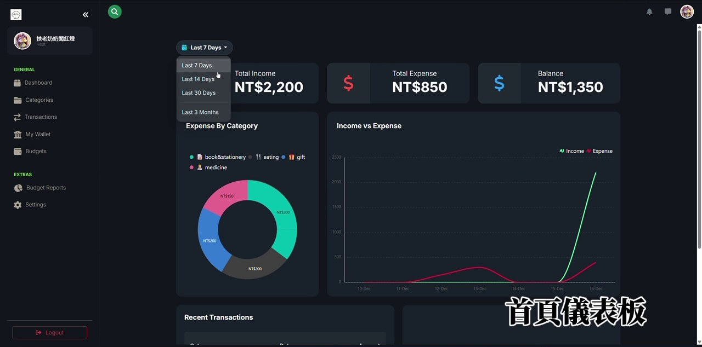
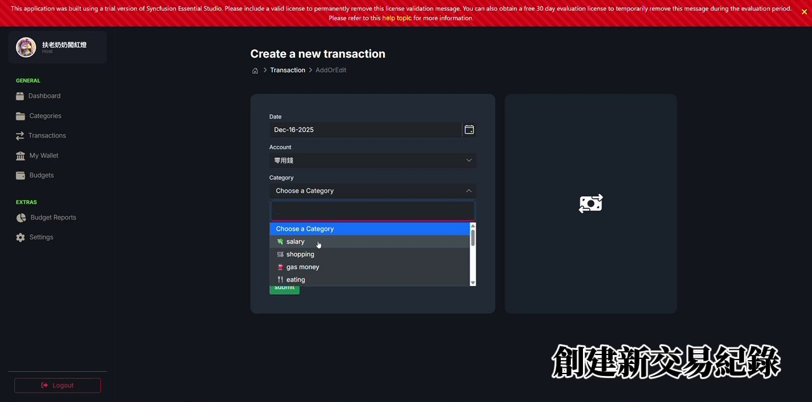
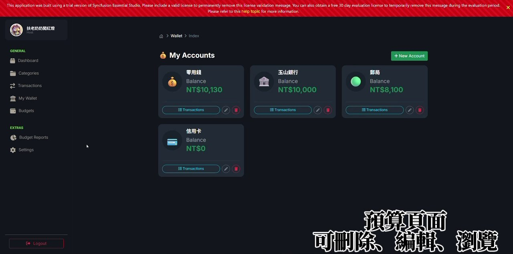
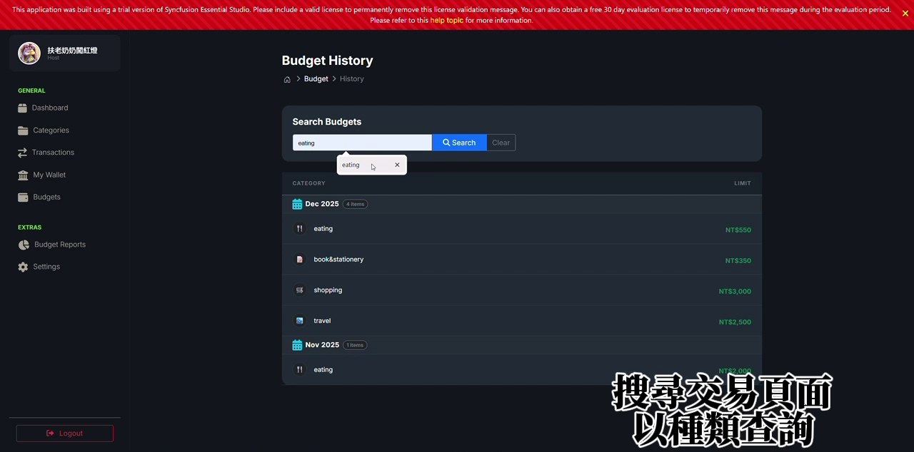

# Database Systems Final Project — Expense Tracker

## Introduction
本專題使用 **ASP.NET Core MVC** 搭配 **SQL Server** 製作一個個人記帳網站
- 註冊並登入後，每位使用者只會看到自己的資料
- 可以記錄收入與支出、管理多個錢包帳戶、設定每月預算
- 首頁儀表板以圖表呈現收支狀況

## Features
### 會員系統
- 註冊、登入、登出（ASP.NET Core Identity）
- 註冊時可上傳大頭貼，之後可在個人頁面修改名稱與大頭貼，或刪除帳號

### 首頁儀表板
- 顯示總收入、總支出、結餘
- 可切換最近 7 天 / 14 天 / 30 天 / 3 個月
- 各類別支出圓餅圖、收入與支出趨勢折線圖、最近交易紀錄

### 類別
- 新增、編輯、刪除收支類別，可選擇圖示並設定為收入或支出

### 交易紀錄
- 新增、編輯、刪除交易，記錄日期、帳戶、類別、金額與備註
- 交易歷史可依關鍵字與日期區間搜尋

### 錢包
- 管理多個帳戶（例如現金、銀行、信用卡），顯示各帳戶餘額與交易明細

### 預算
- 依類別設定每月預算，可新增、編輯、刪除
- 預算歷史可依類別搜尋
- 預算報表可選擇年份與月份，比較預算與實際支出

| 新增交易 | 錢包 | 預算歷史 |
| :---: | :---: | :---: |
|  |  |  |

## Code
### 架構
- `Models/`: 資料表模型，包含 `Transaction`、`Category`、`Account`、`Budget`、`ApplicationUser`
- `Controllers/`: 各功能的 Controller（`Dashboard`、`Transaction`、`Category`、`Wallet`、`Budget`、`Report`、`Account`）
- `Views/`: Razor 頁面，共用 `_Layout` 與 `_SideBar`
- `Migrations/`: Entity Framework Core Code First 的資料庫遷移紀錄

### 資料庫
- 使用 Entity Framework Core 以 Code First 建立資料表，連線到 SQL Server LocalDB
- 每張資料表都有 `UserId` 欄位，查詢時只取出目前登入使用者的資料

### 使用的套件
- ASP.NET Core 8 MVC、Entity Framework Core、ASP.NET Core Identity
- Syncfusion EJ2（圖表與表單元件）
- Bootstrap

## How to Run
1. 使用 Visual Studio 開啟 `expense tracker.sln`
2. 確認 `appsettings.json` 中的 `DevConnection` 指向可用的 SQL Server（預設為 LocalDB）
3. 在套件管理器主控台執行 `Update-Database` 建立資料表
4. 執行專案，從登入頁面註冊帳號後即可使用

> Syncfusion 為試用版授權，頁面上方會顯示授權提示橫幅。
